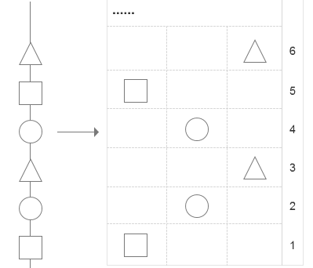
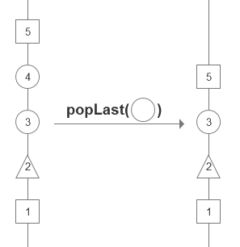

# Spiral Linked List
A linked list that supports storage of multiple types

## Intro
Different elements are stored in a linked list, and each type of element will form an independent column set, and elements of the same type may not be directly connected. The last element of each column named `head node`. 

After the elements are stored in the list, you can directly pop out the last element that matches a specified type

